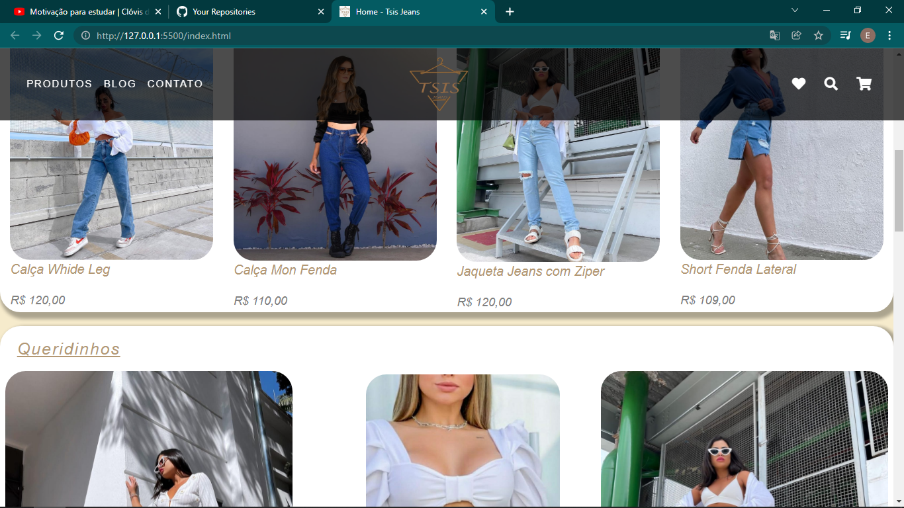

# Tsisjeans

Esse foi o meu primeiro projeto com complexo trabalhando com bootstrap, ele é meio antigo mas acho valido deixar aqui de referencia.

O intuito do projeto foi desenvolver a home de uma loja virtual com a maior parte da sua responsividade sendo construida com bootstrap.

Por falta de habilidades com edição de fotos e como o projeto é apenas um objeto de estudos as duas imagens do slide são as mesmas 

### Tecnologias utilizadas:
- HTML
- CSS
- BOOTSTRAP
- Javascript

### Aos devs:
- Fiquem a vontade para analisar o codigo e oferecer soluções melhores, quem sabe não criamos um projeto open source
- É importante ressaltar que a "Tsisjeans" é uma marca existente e detentora de todos os direitos autorais desse projeto

Visualize o projeto : https://elias2031.github.io/Tsisjeans/

